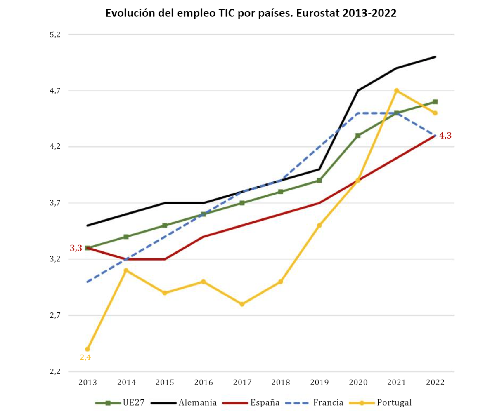

[Volver al índice general](../README.md)

# UD1 – Análisis del entorno y detección de necesidades tecnológicas

## Índice de apartados

- [ ] **1. Análisis del sector tecnológico**

Si hablamos del sector tecnológico en Sevilla, podemos decir que vive un momento de pura expansión y se ha convertido en uno de los principales motores económicos de la ciudad, con un crecimiento destacado del número de empresas y del empleo TIC en los últimos años.​

Sevilla TechPark concentra 574 empresas, cuenta con más de 31.600 trabajadores y genera una actividad económica de 5.513 millones de euros anuales, lo que lo sitúa entre los parques científicos y tecnológicos más importantes de España.​

Además, Sevilla ha superado recientemente a Málaga en número de empresas tecnológicas, alcanzando en torno a las 250 compañías tech, muchas de ellas startups y scaleups, lo que confirma la consolidación de un ecosistema innovador donde se demandan servicios de infraestructuras IT, cloud, redes y ciberseguridad.

- [ ] **2. Selección de la empresa o contexto de trabajo**

- [ ] **3. Identificación de necesidades tecnológicas**
- [ ] **4. Oportunidades y viabilidad del proyecto**
- [ ] **5. Obligaciones legales y normativas**
- [ ] **6. Guion inicial del proyecto**

## Enlaces a recursos de la unidad

- [Documentos de la unidad](./documentos/)
- [Diagramas e imágenes](./img/)

  ## Bibliografía / Webgrafía 
- Autor1, Título del libro o artículo, Editorial/Año.
- Sitio web oficial: [Enlace](https://www.ejemplo.com)
- Sitios web del análisis del sector tecnológico:
  
  1.[El economista](https://empresite.eleconomista.es/Actividad/EMPRESAS-TECNOLOGICAS/provincia/SEVILLA/)

  2.[ElReferente](https://elreferente.es/actualidad/sevilla-adelanta-a-malaga-en-numero-de-empresas-tech-por-primera-vez-en-una-decada-pero-factura-la-mitad/)

  3.[alandalusinnovation](https://alandalusinnovation.com/andalucia-afianza-su-posicion-en-el-ecosistema-tech-espanol-con-714-empresas-y-mas-de-747-millones-de-euros-en-facturacion/)

  4.[pymesmagazine](https://pymesmagazine.es/actualidad/sevilla-techpark-lidera-por-quinto-ano-el-ranking-de-parques-tecnologicos-en-espana/)

  5.[europapress](https://www.europapress.es/esandalucia/sevilla/noticia-ingenierias-sede-sevilla-techpark-incrementan-73-actividad-economica-2024-20250828114449.html)

  6.[alandalusinnovation](https://alandalusinnovation.com/andalucia-afianza-su-posicion-en-el-ecosistema-tech-espanol-con-714-empresas-y-mas-de-747-millones-de-euros-en-facturacion/)

  7.[ElReferente](https://elreferente.es/actualidad/sevilla-adelanta-a-malaga-en-numero-de-empresas-tech-por-primera-vez-en-una-decada-pero-factura-la-mitad/)

- Sitios web de la selección de la empresa o contexto del trabajo

  
- Tutoriales y guías recomendadas: [Enlace](https://www.ejemplo2.com)

