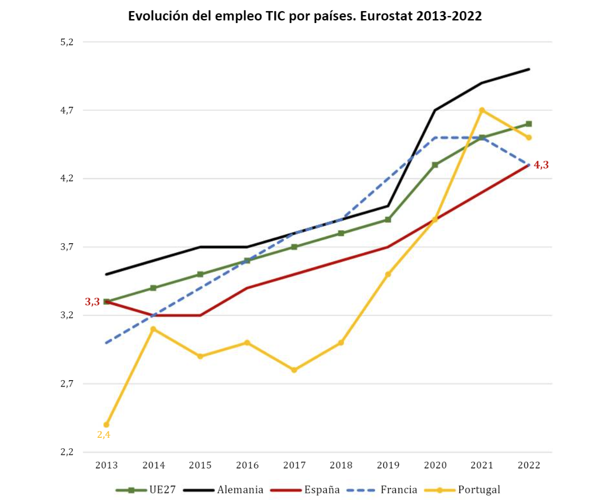

[Volver al índice general](../README.md)

# UD1 – Análisis del entorno y detección de necesidades tecnológicas

## Índice de apartados

- [ ] **1. Análisis del sector tecnológico**

Si hablamos del sector tecnológico en Sevilla, podemos decir que vive un momento de pura expansión y se ha convertido en uno de los principales motores económicos de la ciudad, con un crecimiento destacado del número de empresas y del empleo TIC en los últimos años.​

Sevilla TechPark concentra 574 empresas, cuenta con más de 31.600 trabajadores y genera una actividad económica de 5.513 millones de euros anuales, lo que lo sitúa entre los parques científicos y tecnológicos más importantes de España.​

Además, Sevilla ha superado recientemente a Málaga en número de empresas tecnológicas, alcanzando en torno a las 250 compañías tech, muchas de ellas startups y scaleups, lo que confirma la consolidación de un ecosistema innovador donde se demandan servicios de infraestructuras IT, cloud, redes y ciberseguridad.

- [ ] **2. Selección de la empresa o contexto de trabajo**

Fitness Sport Hidalgo es un gimnasio tradicional en Coria del Río de la provincia de Sevilla, es dirigido por Juan Hidalgo, el cual es nutricionista con más de 30 años de experiencia en el fitness.​

Su estructura es simple y jerárquica, el señor Juan Hidalgo es quien se emcarga de la dirección general, dos administrativos gestionan inscripciones y cobros en Excel desde la recepción, cuenta con ocho monitores que dirigen los entrenamientos, las clases de zumba, spinning, y las pesas, el señor Juan Hidalgo supervisa las lavores de mantenimiento y de abrir el local, y un responsable de marketing que impulsa la captación vía redes sociales.​

La informática actual es mínima, cuentan con dos PC Windows 10 obsoleto, WiFi básico y cero backups o red segura, camaras de seguridad, pero poco más. Esto nos lleva al siguiente punto.

- [ ] **3. Identificación de necesidades tecnológicas**

Fitness Sport Hidalgo cuenta con una infraestructura obsoleta que frena su crecimiento, no cuenta con copias de seguridad automatizadas, red sin segmentación, cuenta solo con dos PC que están desactualizados, procesos manuales de inscripción y pagos, no cuentan con seguridad de acceso al gimnasio.

Este proyecto buscará transformar estas carencias mediante servidor de dominio centralizado para la gestión de usuarios, sistema de backups automatizados con almacenamiento híbrido, una red LAN/WiFi segmentada con firewall perimetral, una plataforma en la nube para la gestión de reservas y un control de acceso digital IDQR (control de acceso por código QR).

- [ ] **4. Oportunidades y viabilidad del proyecto**

La transformación digital del centro deportivo Fitness Sport Hidalgo es una gran oportunidad para continuar desarrollandose como empresa, pasar de ser un gimnasio tradicional, a centro fitness inteligente, con soluciones como un servidor dedicado para la gestión de usuarios centralizados, los backups, también poder tener la red empresarial LAN/WiFi segementada, la plataforma en la nube para las reservas y accesos por código QR por movil, eliminando las carencias actuales.

El impacto que podría tener es de más de un 45% de eficiencia, una seguridad muchisimo más alta, gracias a las copias de suguridad como también por la red segmentada, la gestión de los usuarios centralizada, así como también generando una experiencia más premium al usuario, con la implementación de las reservas online o el ingreso a las instalaciones por medio del QR, reduciendo el error humano en los procesos de hasta un 60%, generando un interes mayor y un posible aumento de más del 30% en socios.

La inversión estimada en pyme es de unos 2.450€ inicial, esto incluiria el servidor dedicado, dos PCs, un switch, aparte de todo lo anterior mencionado, podriamos decir que 35€/mes en la nube, todo controlado con Software open source, como Ubuntu Sever y pfSence.

- [ ] **5. Obligaciones legales y normativas**

#### RGPD / LOPDGDD

Protección datos socios (DNI, salud, pagos): registro tratamientos, consentimiento explícito, encriptación, backups seguros, notificación brechas AEPD (72h).​

#### Prevención Riesgos Laborales (PRL)

Formación obligatoria personal: uso seguro sistemas, ergonomía equipos, protocolos ciberseguridad.

#### Licencias software

100% open source (Ubuntu Server, pfSense): cero costes licencias, cumplimiento legal total.

#### Obligaciones fiscales

Facturación hardware/software (IVA 21%), deducciones inversiones informáticas Agencia Tributaria.

- [ ] **6. Guion inicial del proyecto**

### Nombre del proyecto

"FitTech Hidalgo"

### Datos de la empresa

Fitness Sport Hidalgo: Gimnasio tradicional en Coria del Río (Sevilla). Estructura: Dirección (Juan Hidalgo), 2 administrativos, 8 monitores, operaciones y marketing. Gestión manual (Excel, llaves físicas).

Análisis del sector
Sevilla lidera crecimiento TIC Andalucía con 250+ empresas tech y Sevilla TechPark como referente nacional. Demanda soluciones digitales para pymes fitness.

Necesidades detectadas
Sin backups, WiFi inseguro sin segmentación, 2 PCs obsoletos, reservas manuales, accesos por llaves físicas.

Proyecto propuesto
Servidor dedicado (dominio+backups híbridos), red LAN/WiFi segmentada+firewall, plataforma cloud reservas, control acceso IDQR smartphones.

Recursos y viabilidad
2.450€ inicial (servidor 1.500€, PCs 600€, switch 150€, QR 200€). Software open source GRATUITO. Cloud 35€/mes. ROI 5 meses. ASIR 100% competente.

Obligaciones legales
✅ RGPD/LOPDGDD: Datos socios protegidos.
✅ PRL: Formación personal ciberseguridad.
✅ Licencias: Open source legal.
✅ Fiscal: IVA 21% deducible.​

Conclusiones
FitTech Hidalgo posiciona el gimnasio como referente digital en Sevilla. Proyecto viable, escalable, rentable y 100% legal.

## Enlaces a recursos de la unidad

- [Documentos de la unidad](./documentos/)
- [Diagramas e imágenes](./img/)

  ## Bibliografía / Webgrafía 
- Autor1, Título del libro o artículo, Editorial/Año.
- Sitio web oficial: [Enlace](https://www.ejemplo.com)
- Sitios web del análisis del sector tecnológico:
  
  1.[El economista](https://empresite.eleconomista.es/Actividad/EMPRESAS-TECNOLOGICAS/provincia/SEVILLA/)

  2.[ElReferente](https://elreferente.es/actualidad/sevilla-adelanta-a-malaga-en-numero-de-empresas-tech-por-primera-vez-en-una-decada-pero-factura-la-mitad/)

  3.[alandalusinnovation](https://alandalusinnovation.com/andalucia-afianza-su-posicion-en-el-ecosistema-tech-espanol-con-714-empresas-y-mas-de-747-millones-de-euros-en-facturacion/)

  4.[pymesmagazine](https://pymesmagazine.es/actualidad/sevilla-techpark-lidera-por-quinto-ano-el-ranking-de-parques-tecnologicos-en-espana/)

  5.[europapress](https://www.europapress.es/esandalucia/sevilla/noticia-ingenierias-sede-sevilla-techpark-incrementan-73-actividad-economica-2024-20250828114449.html)

  6.[alandalusinnovation](https://alandalusinnovation.com/andalucia-afianza-su-posicion-en-el-ecosistema-tech-espanol-con-714-empresas-y-mas-de-747-millones-de-euros-en-facturacion/)

  7.[ElReferente](https://elreferente.es/actualidad/sevilla-adelanta-a-malaga-en-numero-de-empresas-tech-por-primera-vez-en-una-decada-pero-factura-la-mitad/)

  
- Tutoriales y guías recomendadas: [Enlace](https://www.ejemplo2.com)

